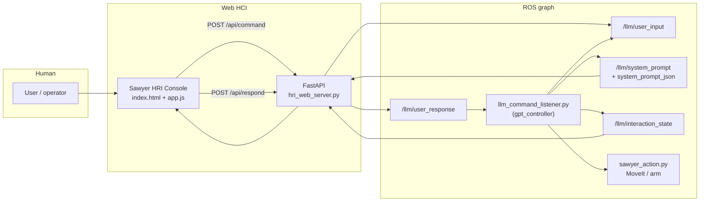
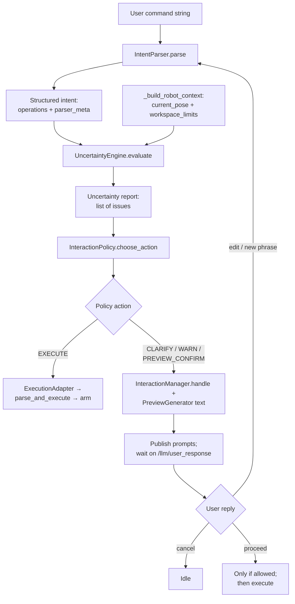

# Sawyer LLM Control: HCI / HRI System Overview

*Presentation-oriented description of the human–robot interaction stack, data flow, and codebase layout.*

---

## 1. What this system is

A **ROS-based natural-language interface** for a **Rethink Sawyer** arm. Users type **motion commands** in plain English (or short phrases). The stack:

1. **Parses** the utterance into a **structured motion intent** (operations in the robot base frame).
2. **Assesses risk and ambiguity** before moving.
3. Optionally runs an **interaction loop**: clarify → preview → safety warning → execute.
4. **Executes** motions via **MoveIt** through a thin **`sawyer_actions`** wrapper (Cartesian moves, gripper, etc.).

**Terminology:**

| Term | Meaning here |
|------|----------------|
| **HCI** | Human–computer interface: the **web console** (browser UI + HTTP API). |
| **HRI** | Human–robot interaction: the full loop including **ROS topics**, **policies**, and **robot execution**. |
| **Interaction layer** | Optional logic in `llm_command_listener.py` that turns every command into intent → uncertainty → policy → dialogs → execution. |

---

## 2. Big-picture architecture



- **Commands** enter ROS on **`/llm/user_input`** (string).
- **Replies** to prompts (proceed, cancel, revised text) use **`/llm/user_response`** — not the command topic (command-like words on `/llm/user_input` are ignored on purpose).
- **Prompts** (human-readable + JSON envelope) publish on **`/llm/system_prompt`** and **`/llm/system_prompt_json`**.
- **Mode / turn / summary** publishes on **`/llm/interaction_state`** (JSON string).

---

## 3. Runtime components (who does what)

| Piece | Role |
|-------|------|
| **`llm_command_listener.py`** | Main ROS node: subscribes to user input, runs **legacy path** or **interaction layer**, calls **`sawyer_actions`** to move. |
| **`gpt.py`** | Wraps OpenAI API: prompts the LLM to output **JSON** with `operations` + legacy `actions` fields. |
| **`intent_parser.py`** | Builds **structured intent**: deterministic regex for `"move … by N cm"` else **LLM**; **`command_schema.normalize_intent`** unifies shape. |
| **`uncertainty_engine.py`** | Scores issues: workspace, displacement, downward move, vague text, missing distance, frame, parse confidence, multi-step. |
| **`interaction_policy.py`** | Maps issue set → **EXECUTE**, **CLARIFY**, **WARN**, or **PREVIEW_CONFIRM** (fixed priority order). |
| **`preview_generator.py`** | Plain-language **preview** text (pose, steps, safety line) for the UI. |
| **`interaction_manager.py`** | Builds prompt strings, publishes envelope, **blocks on** `/llm/user_response`; **WARN** paths omit “proceed” for unsafe plans. |
| **`execution_adapter.py`** | Converts structured **`operations`** into **legacy** `{"actions": [...], "position", "delta"}` for existing **`parse_and_execute`**. |
| **`hci_helpers.py`** | Human-readable summaries, workspace-warning **suggestion chips**, direction parsing. |
| **`sawyer_action.py`** | MoveIt **`MoveGroupCommander`**, workspace box check, `move_relative` / `move_to` / gripper / lift. |
| **`hri_web_server.py`** | **FastAPI** app: `/api/command`, `/api/respond`, `/api/state`, `/api/events`, `/api/stream`, static **`/web/*`**. |
| **`hri_ros_bridge.py`** | Connects HTTP API to ROS **publish/subscribe** and **`HRISessionStore`**. |
| **`hri_session_store.py`** | In-memory **event log** + **latest prompt** + **state** for the UI. |
| **`interaction_logger.py`** | JSONL **interaction_events** for offline analysis. |

---

## 4. Interaction-layer decision pipeline (one command)

Order matters: **WARN → CLARIFY → PREVIEW_CONFIRM → EXECUTE**.



**Turn loop:** Up to **`max_interaction_turns`** (ROS param, default **3**). Each **edit** resubmits a **new command string** into **`IntentParser`** for the next iteration.

---

## 5. Structured intent (what gets planned)

Intents are **lists of operations**, typically:

- **`move_relative`** — `dx, dy, dz` in **base frame** (meters): forward **+x**, left **+y**, up **+z**.
- **`move_to`** — optional absolute pose with **`target_pose`** `{x,y,z}` and **frame**.
- **`open_gripper` / `close_gripper` / `lift`** — as needed.

Metadata includes **`parser_meta.parse_confidence`**, **`magnitude_source`** (explicit vs vague), **`frame`** (e.g. base). The **UncertaintyEngine** and **preview** consume these fields.

---

## 6. Policy outcomes (what the user sees)

| Policy | Typical triggers | Terminal behavior |
|--------|------------------|-------------------|
| **WARN** | Outside **workspace** box; **large** displacement (&gt; ~25 cm total); **large downward** step (&gt; ~8 cm down). | Safety message; **no Proceed** for unsafe execution; revise or cancel; workspace WARN uses **safer suggestion chips** (opposite / orthogonal). |
| **CLARIFY** | “Move left” **without** “10 cm”; **vague** amount; **low** parse confidence; missing **frame** / **z** on move_to. | Ask for a clearer phrase; suggestions for **clarification** mode. |
| **PREVIEW_CONFIRM** | Medium **size** (e.g. ≥ **15 cm** single displacement) or **multi-step** plan. | Plain-language plan + **Proceed** / **Stop** / **Revise**. |
| **EXECUTE** | Clean report, or after user confirms preview. | **ExecutionAdapter** → legacy dict → **`parse_and_execute`** → **`sawyer.move_*`**. |

*(Thresholds live in **`uncertainty_engine.py`** via constructor / future params.)*

---

## 7. Legacy mode (interaction layer off)

If **`/enable_interaction_layer`** is **false** (or unset):

- No intent/uncertainty/policy loop.
- **Callback** routes: **deterministic** `"move … N unit"` regex → **`get_vlm_output`** (LLM) → **`parse_and_execute`** directly.

Useful for **debugging motion** without dialogs.

---

## 8. Web UI (HCI) behavior

- **Interaction Feed:** chat-style log; assistant bubbles use **`white-space: pre-wrap`** so multi-line prompts match **Session (live)**.
- **Session (live):** mode, request id, turn, command, prompt type, **short summary**, full message, **allowed_actions** (e.g. hide **Proceed** when not in list).
- **Proceed / Stop / Revise:** call **`POST /api/respond`** → **`/llm/user_response`**.
- **Send** in idle-like states posts **`POST /api/command`** → **`/llm/user_input`**.
- State polled from **`/api/state`** (bridged from **`/llm/interaction_state`** + latest prompt).

---

## 9. Repository map (`sawyer_llm_executor`)

```
sawyer_llm_executor/
├── scripts/
│   ├── llm_command_listener.py   # ROS node — main orchestrator
│   ├── gpt.py                  # LLM JSON generation
│   ├── intent_parser.py        # Deterministic + LLM → intent
│   ├── command_schema.py       # normalize_intent
│   ├── uncertainty_engine.py
│   ├── interaction_policy.py
│   ├── interaction_manager.py
│   ├── preview_generator.py
│   ├── execution_adapter.py
│   ├── hci_helpers.py
│   ├── interaction_logger.py
│   ├── sawyer_action.py        # MoveIt execution
│   ├── hri_web_server.py       # FastAPI
│   ├── hri_ros_bridge.py
│   ├── hri_session_store.py
│   └── hri_ui_logger.py
└── web/
    ├── index.html
    ├── app.js
    └── styles.css
```

---

## 10. Logs and operations

| Log | Purpose |
|-----|---------|
| `logs/interaction_events.jsonl` | Policy decisions, handoff to execution, outcomes. |
| `logs/hri_ui_events.jsonl` | Web API commands/responses. |

**Runbook** for bring-up: **`HRI_WEB_DEMO_RUNBOOK.md`** (launch order, acceptance checks, policy tables).

---

## 11. What this stack does *not* include

- **Vision** paths live in other packages/branches (**e.g. vision_integration**); base **HCI** doc is motion + LLM + web.
- **MoveIt failures**, **IK**, **collision** at execution time are not turned into the same **issue types**; they surface as **failed** `move_*` in **`sawyer_action`**.

---

## 12. Suggested presentation flow (slides)

1. **Problem:** Natural language control of Sawyer with **safety** and **clarity** before moving.  
2. **Stack:** ROS + LLM + web UI + MoveIt.  
3. **Diagram:** User → Web → ROS listener → intent → uncertainty → policy → (dialog or execute) → arm.  
4. **Intent schema:** Operations in base frame; deterministic vs LLM.  
5. **Policies:** WARN / CLARIFY / PREVIEW / EXECUTE with examples.  
6. **Demo:** underspecified → clarify; large move → preview; out of workspace → warn, no proceed.  
7. **Future:** vision-grounded commands, tuned thresholds, richer intent types.

---

*Generated from the `ros_ws/src/sawyer_llm_executor` codebase layout and behavior.*
